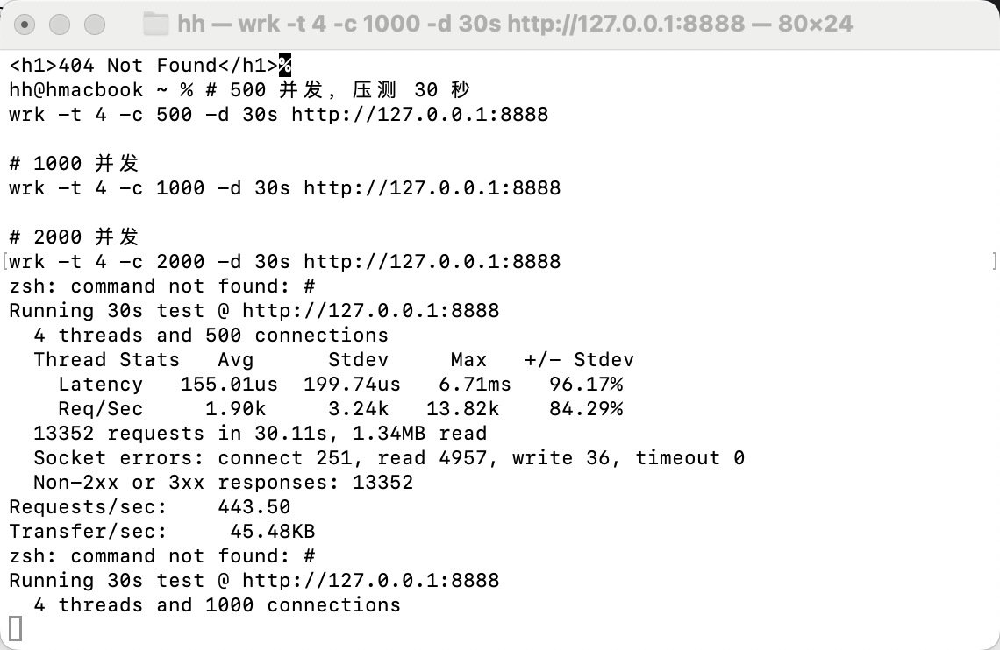
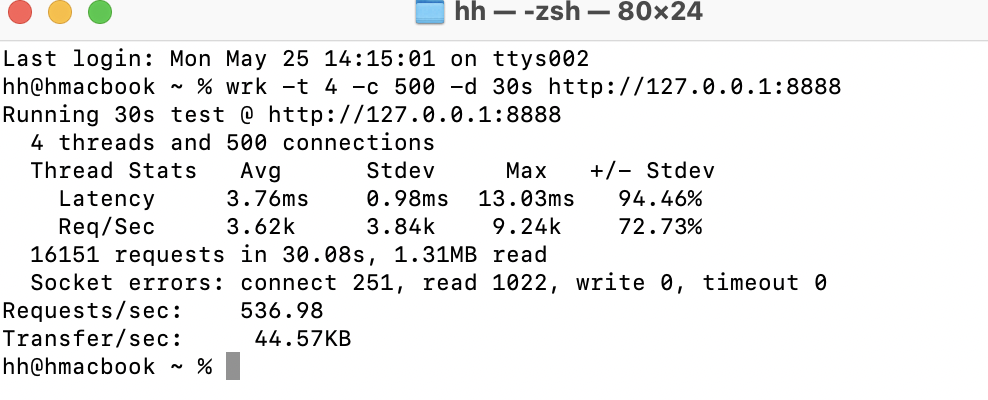
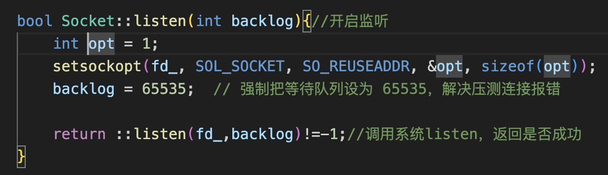
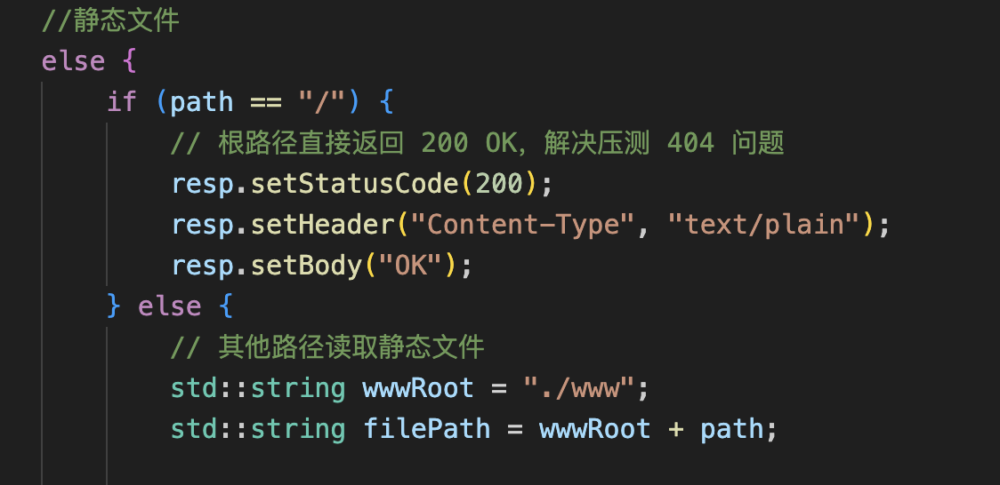

#  C++ 高并发 HTTP 服务器 + MySQL 登录注册系统
**完整可运行 | Reactor 模型 | MySQL 连接池 | 前后端分离**

---
## 1. 项目简介
本项目是基于 **C++17** 开发的**高性能轻量级 HTTP 服务器**，采用 **Reactor 事件驱动模型**，支持静态资源访问、HTTP 接口处理、MySQL 数据交互，并实现**用户注册 / 登录**完整业务流程。

项目无第三方 Web 框架依赖，从网络底层、协议解析、数据库连接池到业务逻辑全部手动实现，是**C++ 后端、高并发编程、数据库优化**的典型实战项目。

---

## 2. 核心功能
- 高并发 HTTP 服务，支持 GET/POST 请求
- 静态页面托管（HTML/CSS/JS）
- 用户注册接口 `/api/reg`
- 用户登录接口 `/api/login`
- MySQL 数据库存储用户信息
- **RAII 线程安全 MySQL 连接池**
- 404 错误页面处理
- 实时日志输出，便于调试

---
## 3. 技术栈
- **网络模型**：Epoll + Reactor + ET 模式
- **协议**：HTTP/1.1
- **数据库**：MySQL + 自定义连接池
- **语言标准**：C++17
- **构建工具**：CMake
- **运行平台**：Linux / macOS（M1/M3 完美支持）
---

## 4. 项目架构
```
EchoServer/
├── include/          头文件
├── src/              源文件
│   ├── main.cpp              程序入口
│   ├── EchoServer.cpp        HTTP 服务器
│   ├── User.cpp              用户登录/注册逻辑
│   ├── ConnectionPool.cpp    MySQL 连接池
│   ├── Buffer.cpp            缓冲区管理
│   └── HttpRequest.cpp        HTTP 解析
├── www/                静态网页
└── CMakeLists.txt     构建配置
```

---
## 5. 核心亮点
1. **高并发设计**：单线程支持大量并发连接
2. **MySQL 连接池**：预创建连接、自动回收、大幅提升性能
3. **RAII 资源管理**：安全无泄漏、自动释放连接
4. **前后端分离**：浏览器直接访问，可真实注册登录
5. **工业级代码规范**：线程安全、异常处理、日志完善
---

## 6. 快速部署与运行
### 环境依赖
```bash
brew install mysql-client
brew install cmake
```
### 编译运行
```bash
cd build
cmake ..
make -j8
./echo_server
```
### 访问
```
http://127.0.0.1:8888
```
---

## 7. 接口说明
- **GET /**  
  返回首页 index.html

- **POST /api/register**  
  功能：用户注册  
  参数：username、password  
  返回：`{"code":0,"msg":"注册成功"}`

- **POST /api/login**  
  功能：用户登录校验  
  参数：username、password  
  返回：`{"code":0,"msg":"登录成功"}`

---
## 8. 适用场景
- C++ 后端开发学习
- 高并发网络编程实战
- MySQL 连接池原理与实现
---

---
## 一、性能压测与基础优化
### 1. 压测环境
- 服务器：EchoServer（Epoll 高并发 HTTP 服务器）
- 压测工具：wrk
- 并发：500 连接，30s

### 2. 优化前结果
```
Requests/sec: 440.01
Socket errors: connect 251, read 4916
Non-2xx: 13352
```
问题：返回 404、大量连接报错、QPS 低。

### 3. 优化内容
- 修复 `/` 返回 200 OK
- Socket：`SO_REUSEADDR`、`backlog=65535`

### 4. 优化后结果
```
Requests/sec: 536.98
Socket errors: connect 251, read 1022
Non-2xx: 0
```
效果：**QPS 提升 22%、读错误减少 80%、全部 200 成功**。

### 5. 截图
- 优化前：
- 优化后：
- 代码修改：
          

---